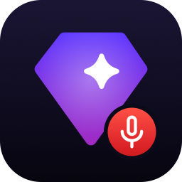

<div align="center">



# SAP Jarvis

**Voice to text, straight into the app you are working in. On-device, on your Mac.**

Click into any text field, press a shortcut, speak Czech, English or both in one sentence.
The text appears at your cursor a second after you stop. Nothing leaves the machine.

**macOS only (Apple Silicon, macOS 26+).** There is no hosted download yet: you build and
install it on your own Mac with the two commands below, which takes a few minutes.

[](#requirements)
[](#how-it-works)
[](https://swift.org)
[](https://github.com/argmaxinc/argmax-oss-swift)
[](#languages)
[](#privacy)

<sub>SAP-internal</sub>

</div>

## Highlights

- **Insert at the cursor.** Native apps get the text through Accessibility, Electron apps and
  terminals through ⌘V with your clipboard restored afterwards. Clipboard-only mode is available.
- **Speak, do not wait.** Voice activity detection splits speech into chunks that are transcribed
  while you are still talking. Stop, and the text is in place about a second later.
- **Mixed languages, no switching.** Language is detected per chunk, so Czech with English terms,
  or a sentence that changes language halfway, comes out right without picking a language first.
- **Two ways to talk.** Toggle with ⌘; and ⌘', or hold ⌃⌥Space while you speak. All shortcuts
  are configurable and bound to physical keys.
- **Menu-bar app.** Settings for language preferences, model, microphone, vocabulary, VAD tuning,
  sounds and launch at login. Permissions are explained on first launch.

## Languages

Auto-detect is the default and the recommended setting; the model identifies the language of each
spoken chunk on its own. A preferred-language list narrows detection when you only ever use a few.

| | | | |
|---|---|---|---|
| 🇨🇿 Czech | 🇬🇧 English | 🇸🇰 Slovak | 🇩🇪 German |
| 🇪🇸 Spanish | 🇫🇷 French | 🇮🇹 Italian | 🇵🇱 Polish |
| 🇵🇹 Portuguese | 🇷🇺 Russian | 🇺🇦 Ukrainian | 🌐 Auto-detect |

A vocabulary field (names, products, abbreviations such as "SAP, BTP, Jira") biases spelling.

## Install (build on your Mac)

Requires Xcode 26 and Homebrew. Everything is built and signed locally, so the app runs on
the Mac you build it on without any further approval.

```bash
brew install xcodegen
git clone https://github.tools.sap/I314819/sap-jarvis.git && cd sap-jarvis
scripts/make-dev-cert.sh          # once per Mac: local signing certificate
scripts/package.sh --install      # Release build → dist/*.dmg, *.pkg; installs and launches
```

Then launch **Jarvis** from Spotlight or Launchpad, or enable *Launch at login* in Settings.
To update, `git pull` and run `scripts/package.sh --install` again; permissions stay granted.

The app goes to `/Applications`. On a managed Mac that folder needs admin rights: get them
first (Privileges app), or let the script fall back to `~/Applications`, which works the same.

The `dist/` packages are for the same Mac. Managed SAP Macs only run Developer ID signed and
notarized apps downloaded from elsewhere, so a shared download needs the SAP signing pipeline
first (see `AGENTS.md`, known gaps).

On first launch Jarvis asks for **Microphone** and **Accessibility** in
System Settings → Privacy & Security. The speech model (1.6 GB) downloads once into
`~/Library/Application Support/Jarvis/Models`; the first load prepares it for the Neural Engine
and takes a minute or two, later launches take a few seconds.

The local certificate matters: macOS binds permission grants to the app's signing identity.
`scripts/make-dev-cert.sh` creates a "Jarvis Dev" certificate in your login keychain so grants
survive rebuilds. Distribution builds will use an SAP Developer ID instead.

## Use

1. Click where the text should go.
2. Press ⌘; and speak, or hold ⌃⌥Space while speaking.
3. Press ⌘' or release ⌃⌥Space. A sound confirms the insertion.
4. ⌘. cancels.

Something off? *Report an Issue…* in the menu opens the tracker on SAP GitHub with your version
and model pre-filled.

## Requirements

Apple Silicon Mac, macOS 26 or newer, about 2 GB of disk for the model. Xcode 26 and
`xcodegen` to build.

## How it works

```
AVCaptureSession ─► Silero VAD ─► WhisperKit large-v3-turbo ─► filters ─► insert at cursor
 16 kHz mono         chunks         per chunk, ANE             hallucination,   AX write, verified
                     by pauses      language detected          duplicates       → ⌘V → clipboard
```

| Path | Role |
|---|---|
| `App/` | SwiftUI menu-bar app: state machine, menu, Settings, onboarding, design sources. |
| `Core/` | SwiftPM package `JarvisCore`: capture, VAD, transcription, filters, session, text injection, hotkeys, settings. `jarvis-cli` and tests. |
| `scripts/` | `build.sh`, `package.sh`, `make-dev-cert.sh`, `render-icons.sh`, `lint.sh`. |
| `project.yml` | xcodegen spec for `Jarvis.xcodeproj` (generated, not committed). |

## Privacy

- **Voice:** recognized on this Mac by the Neural Engine. Audio stays in memory and is discarded
  after each recording; nothing is written to disk, nothing is sent anywhere.
- **Text:** goes only into the app you dictate into, or to the clipboard when you choose so. The
  clipboard copy is marked transient so clipboard managers skip it, and the previous clipboard is
  restored. Transcripts are never logged; diagnostics contain timings, sizes and device names.
- **Network:** a one-time model download from huggingface.co. No analytics, crash reporting or
  update checks. *Report an Issue* opens SAP GitHub in your browser only when you click it.
- **Stored locally:** settings in the app's preferences (`com.sap.jarvis`) and the models in
  `~/Library/Application Support/Jarvis/Models`. Settings → Privacy shows both and can reset the
  settings.
- **Permissions:** Microphone (only while recording) and Accessibility (only to place text at the
  cursor and send ⌘V; no screen or keystroke reading). No Input Monitoring, no Screen Recording.
- **No accounts:** no Apple ID, iCloud or SAP login is used; nothing syncs.

## Development

```bash
cd Core && swift build && swift test
scripts/lint.sh                 # swift-format, strict
scripts/build.sh Debug --open   # quick Debug build and launch
Core/.build/debug/jarvis-cli record --seconds 8 --insert
```

See `AGENTS.md` for conventions and runtime facts worth knowing before changing capture,
transcription or insertion.
